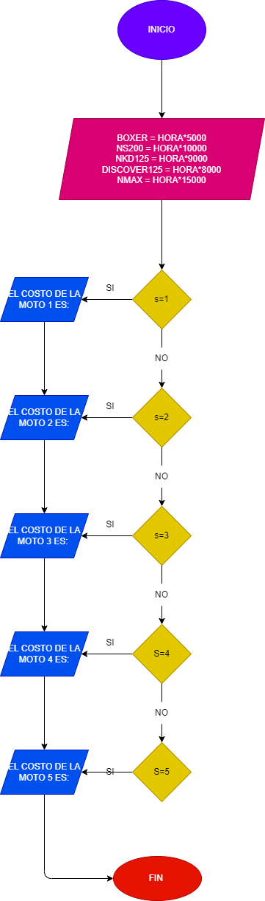

# Progama del proyecto de fundamentos de programación 

Crear una aplicación de fácil acceso, en la cual se desarrolle un apartado donde se pueda rentar motos para el uso de cualquier individuo que obviamente cumpla las condiciones para el alquiler de sí mismo.

	Diseñar en una programación que ayude a resolver la problemática de la renta de motos en Colombia.
	Desarrollar en visual estudio un código cual nos permita ayudar a la comunidad que tiene esta problemática.
	Implementar en el área nacional un programa con el cual se busca soluciones a las personas que deseen este servicio facilitando el medio por el cual puedan reservar el vehículo.

Nombre del protecto "AGUANCHA MOTOR"

